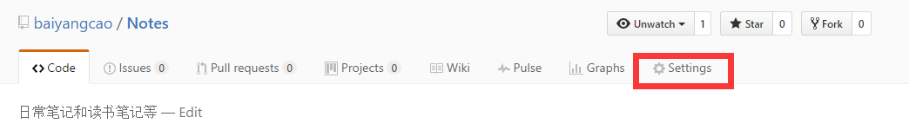
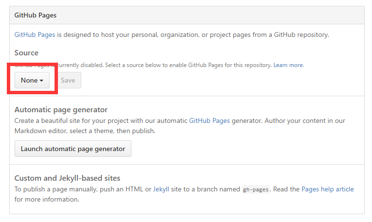
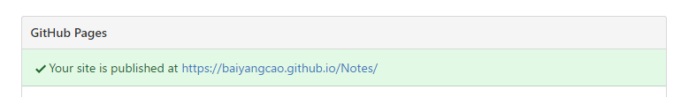
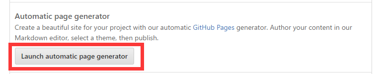
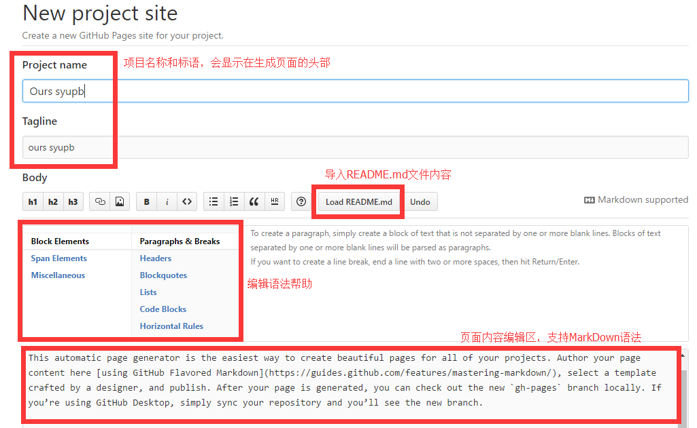
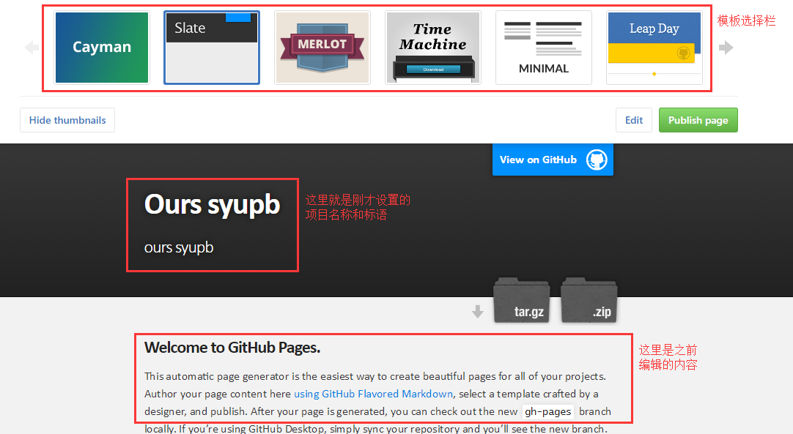

# 利用Github Pages建立仓库“门面”

## 嘛是Github Pages？

**Github Pages 是一个静态网站托管服务**，用来从你的Github仓库中直接发布
个人、组织或项目的网站页面  
  
Github Pages发布的页面统一使用`github.io`域名，网站名称一般为
`http(s)://<username>.github.io/<projectname>`或者
`http(s)://<orgname>.github.io/<projectname>`  
  
**使用时有如下要求：**

 - Github Pages源仓库不应超过1GB
 - 发布的网站大小不应该超过1GB
 - Github Pages网站每月有100GB的带宽和100000请求量的限制
 - Github Pages网站每小时构建次数不超过10次

## 配置Github Pages源仓库

**Github Pages源文件可以配置为`master`、`gh-pages`分支或者`master`分支中的`/docs`文件夹，**
如果是个人或组织的网站页面（域名为`http(s)://<username>.github.io/`或`http(s)://<orgname>.github.io/`）
则其源文件只可以配置为对应仓库（仓库名对应为`<username>.github.io`或`<orgname.github.io>`）的`master`分支 

默认情况下Github Pages功能是被关闭的，可以在仓库的设置页面中的Github Pages面板看到：

  
配置项`Source`就是指Github Pages的源文件，
这里我选择了`master`分支下的`/docs`文件夹作为网站源文件目录，
然后单击旁边的`Save`按钮即可

  
接着我们就可以看到提示  

  
这时候单击这个连接我们就可以看到一个`404`的页面（囧~~），
因为我们的`/docs`目录下还没有网站文件，默认是显示源目录下的`index.html`文件，
我们可以拷贝下来版本库自己编辑页面，可以通过Github提供的自动生成器来生成  
  
## 生成Github Pages首页

设置页面中Github Pages面板下提供的`Launch automatic page generator`功能可以让我们使用指定模板生成单页面网站，

在弹出的页面中设置项目名称，页面标题，以及页面内容即可，
页面内容可以从README.md文件中导入并且支持MarkDown语法
  
  
编辑完成后单击`Continue to layouts`来选择要使用的布局模板
  
在上方选择模板，然后在下方进行预览，如果有不满意的地方，
点击右上角`Edit`按钮返回编辑页面，完成后点击`Publish pages`页面发布页面即可  
  
然后就可以通过之前生成的链接来访问生成的页面了，这个时候再去`/docs`目录下看一下，
就会发现已经自动生成了一大堆的文件，自动生成器仅可以在改变`Source`的时候使用，
以后再更新页面可以通过修改源文件或使用Jekyll静态页面生成工具来实现  
  
## 生成个人主页

之前生成的是某个仓库的项目主页（链接为`http(s)://<username>.github.io/<projectname>`），
若是想生成个人主页（链接为`http(s)://<username>.github.io/`）则只需添加名为`<username>.github.io`的仓库，
并设置相对应的Github Pages即可

> 参考连接：  
> <https://help.github.com/articles/what-is-github-pages/>  
> <https://help.github.com/articles/configuring-a-publishing-source-for-github-pages/>  
> <https://help.github.com/articles/creating-pages-with-the-automatic-generator/>
