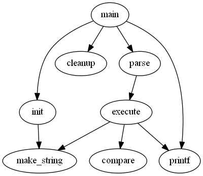
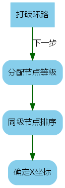

# Graphviz - dot用法入门

## Graphviz

Graphviz是来自贝尔实验室的一个图形可视化绘制工具，
可以通过简单的代码来生成结构化图形，
现已在[GitHub](https://github.com/ellson/graphviz)上开源。
而其用来生成图形的语言就叫做`DOT`。
对应的编译器（原谅程序员的叫法...）有`dot`和`neato`。

## dot基本概念

`dot`程序可以绘制层次化的有向图，
它可以作为命令行程序、可视化Web服务或者图形化界面运行。
  
`DOT`中主要有三个对象，图(graph)，节点(node)，边(edge)，
图分为有向图(digraph)和无向图(graph)，`dot`用来绘制有向图，
而无向图则由`neato`绘制，每个文件包括一个主图，
然后其下可以在包含多个`subgraph`，用于定义一个节点和边的子集。
  
节点在其名称第一次出现在文件中时被创建，而边在节点通过`->`操作符链接时被创建。

`dot`在生成图形时主要有四个步骤：

 - 打破环路：因为`dot`在处理布局的时候不能存在环路，所以首先要通过反转方向来打破环路；
 - 分配节点等级：在自上而下的绘制过程中，等级决定了*Y*坐标，跨越多个等级的边会被分成“虚拟”节点链和单位长的边；
 - 同级节点排序：同一等级内的节点进行排序防止出现交叉；
 - 确定*X*坐标：确保边较短，并美化边样式。

## 基本绘图

下面开始绘制第一个图形，新建一个文本文档`graph1.gv`，
输入如下内容：

```
// graph1.gv
digraph G {
    main -> init;
    main -> cleanup;
    main -> parse -> execute;
    execute -> make_string;
    execute -> printf;
    init -> make_string;
    main -> printf;
    execute -> compare;
}
```

然后在命令行界面中执行命令，生成图片：

```
> dot -Tpng graph1.gv -o graph1.png
```

生成图片如下：



代码中的`main`,`init`等就是之前所说的节点(node)，
而其中由`->`连起来的每一行构成了有向的边(edge)，
节点可以进行链式的链接，如`main -> parse -> execute`。

## 添加属性

我们可以通过设置图、节点、边的属性来美化图形，如下：

```
// graph2.gv
digraph G {
    size = "4,16";  // 设置图属性
    node [  // 设置所有节点的属性  
        fontname = "Microsoft YaHei", 
        fontsize = 12, 
        shape = "Mrecord", 
        color="skyblue", 
        style="filled"
    ];
    edge [  // 设置所有边的属性
        fontname = "Microsoft YaHei", 
        fontsize = 12, 
        color="darkgreen"
    ];
    
    打破环路 [shape=box];   // 设置当前节点的属性
    打破环路 -> 分配节点等级 [label="下一步"];   // 设置当前线的属性
    分配节点等级 -> 同级节点排序 -> 确定X坐标;
}
```

生成图片如下：



如上将dot生成图的主要步骤绘制成了流程图，
图属性直接写在图中即可，节点和线的属性通过在节点和线后添加`[]`来指定属性，
并且可以通过`node`和`edge`来设置图中所有节点和线的属性，
这里注意，指定节点的属性不可以在`->`操作符后的节点上添加属性列表，
因为会被认为是线的属性。