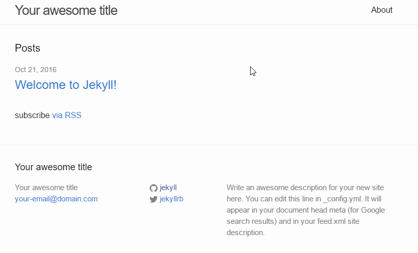
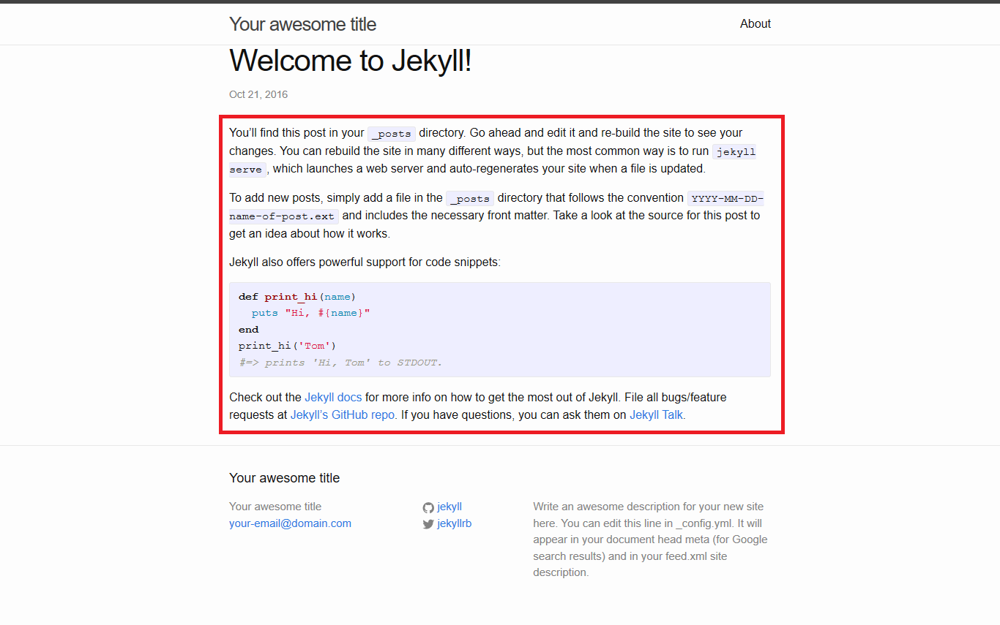
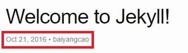

# Jekyll 使用入门

Jekyll 是一个网站生成工具，可以用来将带有一定格式的文本（如：MarkDown）转换成静态的HTML页面，
并提供了Liquid模板引擎进行页面渲染，然后可以将生成的静态网站发布到如 Github Page类似的托管网站上，
实现自己的项目页面，个人博客等。

## 安装

一般使用 RubyGems 来安装 Jekyll，小白的机器是 CentOS 7
（Windows环境下安装可以参考 [windows文档](http://jekyllcn.com/docs/windows/#installation)），
首先安装以下环境：

 - Ruby
 - RubyGems
   ```
   $ sudo yum install ruby
   ```
 - NodeJS，或者其他JavaScript运行环境
   ```
   $ curl --silent --location https://rpm.nodesource.com/setup_6.x | bash -
   $ yum -y install nodejs
   ```
 - Python2.7 （Jekyll2 或更早版本需要，Linux一般自带）

然后安装 Jekyll：

```
$ gem install jekyll
```

> 注意：
> 小白在安装时遇到以下报错：
> ```
> Building native extensions.  This could take a while...
> ERROR:  Error installing jekyll:
>     ERROR: Failed to build gem native extension.
> 
>     /usr/bin/ruby extconf.rb
> mkmf.rb can't find header files for ruby at /usr/share/include/ruby.h
> 
> Gem files will remain installed in /home/bai/.gem/ruby/gems/ffi-1.9.14 for inspection.
> Results logged to /home/bai/.gem/ruby/gems/ffi-1.9.14/ext/ffi_c/gem_make.out
> ```
> 原来还需要安装 ruby development软件包，执行 `sudo yum install ruby-devel`

## 基本使用

新建一个最简单的示例网站

```
$ jekyll new myblog
```

这会在当前目录下创建一个 `myblog` 目录，里面包含一个示例的网站

> 注意：
> ```
> Dependency Error: Yikes! It looks like you don't have bundler or one of its dependencies installed. In order to use Jekyll as currently configured, you'll need to install this gem. The full error message from Ruby is: 'cannot load such file -- bundler' If you run into trouble, you can find helpful resources at http://jekyllrb.com/help/!
> ```
> 缺少bundler包，执行 `gem install bundler` 命令安装

切换到 `myblog` 目录下，构建刚刚生成的网站

```
$ cd myblog
$ jekyll build 
```

默认会将网站生成到 `./_site` 目录下，生成目录可以通过配置文件 `./_config.yml`
或命令行参数 `--destination` 设置  

然后，将网站运行起来，在本地进行预览  

```
$ jekyll server
```

然后可以在浏览器中 `http://127.0.0.1:4000` 来访问，显示如下界面



## 编辑博客

在刚刚预览的网站中可以看到一篇叫做 `Welcome to Jekyll!` 的博文（Post），
这是 Jekyll 示例网站的自带的文章，
其源码为 `./_posts/2016-10-21-welcome-to-jekyll.markdown`  

`./_posts` 目录用来放置博文，文件名称格式为 `<date>-<title>.<extension>`，
文件内容如下：

```
---
layout: post
title:  "Welcome to Jekyll!"
date:   2016-10-21 00:43:30 -0700
categories: jekyll update
---
You’ll find this post in your `_posts` directory. Go ahead and edit it and re-build the site to see your changes. You can rebuild the site in many different ways, but the most common way is to run `jekyll serve`, which launches a web server and auto-regenerates your site when a file is updated.

To add new posts, simply add a file in the `_posts` directory that follows the convention `YYYY-MM-DD-name-of-post.ext` and includes the necessary front matter. Take a look at the source for this post to get an idea about how it works.

Jekyll also offers powerful support for code snippets:


def print_hi(name)
  puts "Hi, #{name}"
end
print_hi('Tom')
#=> prints 'Hi, Tom' to STDOUT.


Check out the [Jekyll docs][jekyll-docs] for more info on how to get the most out of Jekyll. File all bugs/feature requests at [Jekyll’s GitHub repo][jekyll-gh]. If you have questions, you can ask them on [Jekyll Talk][jekyll-talk].
```

文件开头由 `---` 包含的部分被称为“头信息”，设置一些文档的相关属性：

 - `layout`: 表示博文使用的模板名称，对应 `./_layouts/<name>.html` 文件
 - `title`, `date`, `categories`: 分别设置了博文的标题、日期、分类等信息
  
其余的部分是博文正文，对应下图中红色的部分，图中其他的部分皆是在模板中定义的



## 模板、主题

上面说到我们的博文模板对应的是 `./_layouts/post.html` 文件，
但是我们的当前目录下并没有 `./layouts` 目录啊？  
  
其实为了方便重复利用模板， Jekyll提供了主题功能，可以在 `./_config.yml` 
中看到如下配置：

```yaml
theme: minima
```

主题实际上是一个gem包，可以通过 `bundle show minima` 查看主题包所在的位置：

```
$ budnle show minima
~/.gem/ruby/gems/minima-2.0.0

$ cd ~/.gem/ruby/gems/minima-2.0.0
$ ls
assets  _includes  _layouts  LICENSE.txt  README.md  _sass

$ cd _layouts
$ ls
default.html  home.html  page.html  post.html
```

可以看到主题目录下的 `_layouts` 目录里有 `post.html` 模板文件，
这个就是上述博文所用的模板文件，当然，我们也可以在自己的 `./_layouts` 目录下
新建 `post.html` 文件来覆盖主题默认的模板文件。  
  
先来看一下这个模板文件的内容：

```
---
layout: default
---
<article class="post" itemscope itemtype="http://schema.org/BlogPosting">

  <header class="post-header">
    <h1 class="post-title" itemprop="name headline">{{ page.title | escape }}</h1>
    <p class="post-meta"><time datetime="{{ page.date | date_to_xmlschema }}" itemprop="datePublished">{{ page.date | date: "%b %-d, %Y" }}</time>
     • <span itemprop="author" itemscope itemtype="http://schema.org/Person"><span itemprop="name">{{ page.author }}</span></span></p>
  </header>

  <div class="post-content" itemprop="articleBody">
    {{ content }}
  </div>

  
    
  
</article>
```

同样，头信息部分 `layout` 指示模板文件，可以看出post模板之上还有一个网站的默认模板，
然后，模板中有各种 `{{ var | filter }}` 标签，Jekyll 使用 Liquid 模板引擎，
这种结构就是模板标记， `var` 表示变量名称， `filter` 表示要在变量上应用的过滤器，
相当于我们通常所说的格式化字符串  
  
例如 `{{ page.date | date: "%b %-d, %Y" }}` 表示将日期格式化成“月 日，年”的形式，
其中 `page.date`, `page.title` 都是在前面博文头信息中定义的变量，
在模板里可以通过 `page` 对象来访问。

另外，还有 `...`条件控制结构，
表示如果有 `page.author` 变量，则显示出来，否则不显示，
之前的Welcome博文头信息中并没有配置 `author` 属性，现在我们来配置一下，
修改 `./_posts/2016-10-21-welcome-to-jekyll.markdown` 头信息：

```
---
layout: post
title:  "Welcome to Jekyll!"
date:   2016-10-21 00:43:30 -0700
categories: jekyll update
author: baiyangcao
---
```

> 注意：  
> 执行了 `jekyll server` 命令启动预览网站之后，
> 修改了的博文可以自动重新生成，而不用重新启动网站。

然后再打开博文看一下效果，显示出来了文章作者：



接着，我们就可以在 `_layouts` 下新建自己的模板，
在 `_posts` 目录下创建自己的博文。
  
## 发布

我们可以将使用 Jekyll 生成的网站发布到 Github 上，
使用 Github Pages 功能展示出页面，因为 Github Pages 集成了 Jekyll 构建功能，
所以我们只需要将源码推送到 Github 仓库即可  
  
在网站根目录下新增 `.gitignore` 文件，将你的网站生成目录添加到里面，
默认应该是 `_site` 文件夹。  
  
将网站推送到 Github 仓库后，然后设置对应的 Github Pages 即可，
具体可参见 [利用Github Pages建立仓库“门面”](github_pages_basic.md)

## 扩展

其实我们也可以为网站指定其他主题，虽然官网文档上说主题通过 RubyGems 分发，
但是我们一般在网站搜索到的主题并不一定在 RubyGems 上发布，
所以有时我们可以直接将主题源文件直接拷贝到自己的网站根目录来使用。
官方 Github 仓库的 Wiki 页面中有个[主题](https://github.com/jekyll/jekyll/wiki/Themes)
列表，大家有兴趣可以看一下。

> 参考链接：  
> <http://jekyllcn.com/docs/home/>