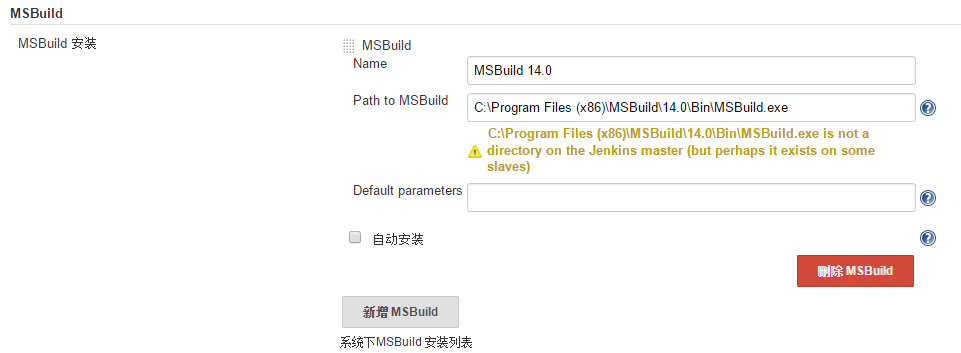

# Jenkins And .NET

[TOC]

本文讲述如何在Jenkins中构建、测试、部署.NET项目

## 插件安装

我们需要安装以下插件：
    1. MSBuild Plugin - 使用MSBuild构建和部署.NET项目
    2. MSTestRunner Plugin - 使用MSTest执行.NET项目测试
    3. MSTest Plugin - 将MSTest结果文件*.trx转换成Jenkins可展示格式
> 关于MSBuild和MSTest，可参见[Jenkins与.NET 番外 MSBuild与MSTest](03 MSBuild and MSTest.md)

可选插件：
    Git Plugin - 用于从git版本库签出代码进行构建
Jenkins自带CVS和SVN插件，支持从这两个版本库中签出代码，这里我们安装Git插件，以从Git版本库签出代码为例。

## 插件配置

### MSBuild配置

进入"系统管理"-->"系统配置"界面，找到MSBuild节点，进行如下配置：  



图中可以配置多个MSBuild，相互之间用Name区分，"Path to MSBuild"字段配置MSBuild.exe文件的路径，安装图上寻找服务器上对应位置的MSBuild.exe文件即可。

> 注：这里的路径应该设置为MSBuild安装目录下的MSBuild路径（如图上所示），而不是.NET运行目录下的路径（如：C:\Windows\Microsoft.NET\Framework64\v4.0.30319\MSBuild.exe），否则在使用SonarQube进行代码分析时会报错，如下：
> ```
> SonarQube Scanner for MSBuild End Step 2.0
> No ProjectInfo.xml files were found. Possible causes: 
> 1. The project has not been built - the end step was called right after the begin step, without a build step in between 
> 2. An unsupported version of MSBuild has been used to build the project. Currently MSBuild 12.0 upwards are supported
> 3. The build step has been launched from a different working folder
> Generation of the sonar-properties file failed. Unable to complete SonarQube analysis.
> ```

### MSTest配置

与MSBuild配置相同，只是路径不同，如图：  


### Git配置

这里需要配置两个节点"Git"和"Git Plugin"，其中"Git"节点的配置与上述相同，配置对应的路径即可，如图：  


而在"Git Plugin"节点下需要配置用户名和用户邮箱，**这个必须要配置，不然以后会出问题**，如下图：  


## 项目配置

完成插件的安装配置就算是搭建好了可以使用的环境，下面就可以新建项目了，这里以控制台项目和ASP.Net项目两种项目为例，分别演示在Jenkins构建、测试和构建、测试、部署.NET项目如何设置。

### 控制台项目

项目结构如下，包含一个控制台项目和一个单元测试项目：  


 1. 首先在Jenkins中单击"新建"新建一个"构建一个自由风格的软件项目"，单击OK
 2. 接着进入到项目的配置管理页面，首先配置"源码管理"节点，选择"Git"，设置版本库地址，并设置相对应的身份凭证就可以了，其他选项可以保持不变，如下：  

 

 3. 然后配置构建参数，在"构建"节点中单击"增加构建步骤"选择"Build a Visual Studio project or solution using MSBuild"，在添加的"Build a Visual Studio project or solution using MSBuild"节点中配置构建相关的参数，如下：  

 

     + MSBuild Version:选择要使用的MSBuild版本，在系统配置中配置的那些；
     + MSBuild Build File:选择解决方案文件
     + Command Line Arguements:命令行参数，图中设置的参数分别代表
         * /t:Rebuild - 重新构建
         * /p:Configuration=Release - 使用Release配置来构建

 4. 其次，配置测试参数，在"构建"节点中单击"增加构建步骤"选择"Run unit tests with MSTest"，在添加的"Run unit tests with MSTest"节点中配置测试相关的参数，如下：  

 

     + MSTest Version：选择要用的MSTest版本，在系统配置中配置；
     + Test Files：要测试的目标文件，是指测试项目生成的dll或exe文件，如果有多个的话可以用多行，**这个必须要设置**；
     + Result File Name：设置测试结果文件的存放位置，必须以*.trx结尾
 
 5. 进行了上一步的设置，系统在构建之后就可以自动运行测试了，但还无法将测试结果展示出来，最后，配置测试报告参数，在"构建后操作"节点中单击"增加构建后步骤"选择"Publish MSTest test result report"，在添加的"Publish MSTest test result report"节点中配置上一步配置的测试结果文件位置，就可以把测试结果展示出来了，如下：  

 

 6. 点击"立即构建"就可以查看Jenkins构建的情况了

#### 构建结果查看

单击对应项目，进入项目页，可以查看项目的相关内容，如下：  


- "工作区"是指项目的目录结构
- "最新修改记录"是指项目最近的一次提交
- "最新测试结果"是项目最近的一次构建的测试结果报告
- 在左下方的"构建历史"面板中展示出了该项目的每一次构建，红色表示失败，蓝色表示成功，单击每一项可以查看详细信息

### ASP.NET项目

Web应用程序大致的步骤与控制台项目类似，只不过是多了网站发布这一步，而这一步可以通过MSBuild的参数控制来实现，只需要在属性参数中添加DeployOnBuild和PublishProfile属性即可
- DeployOnBuild:设置为true，表示在构建完成之后部署
- PublishProfile:指的是发布配置文件，可以在Visual Studio中配置生成

#### 在Visual Studio中创建发布配置文件

 1. 在"解决方案资源管理器"里Web应用项目工程上右键，点击"发布"
 2. 在弹出的"发布Web"页面中，选择"新建自定义配置文件"，然后输入名称（不需要带文件后缀*.pubxml）
 3. 选择相应的"连接"、"设置"等，点击"发布"（若不想此时发布，则可以点击"关闭"），然后在弹出的是否保存配置文件界面选择保存即可
 4. 这样创建出来的发布文件会自动保存在 [项目根目录]/Properties/PublishProfiles文件夹下，后缀名为*.pubxml

PublishProfile属性可以直接指定文件名称（带不带后缀皆可），这样MSBuild会自动在[项目根目录]/Properties/PublishProfiles文件夹下查找，也可以指定文件的绝对路径。


