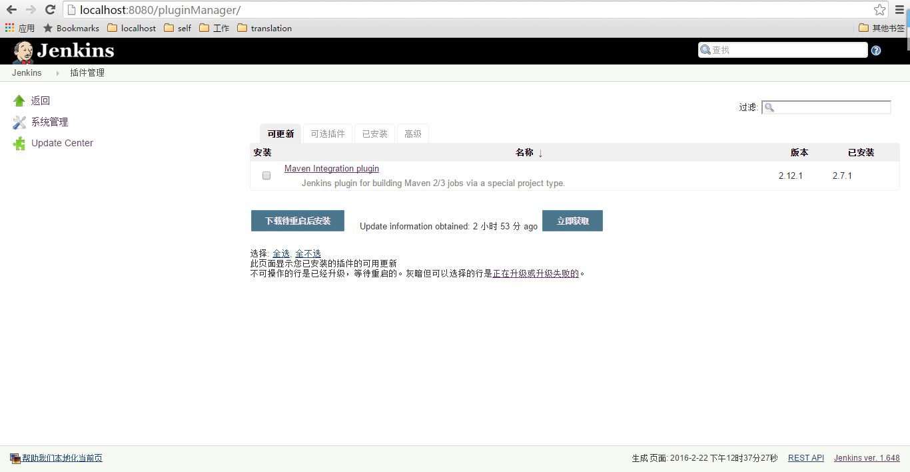

# Jenkins 安装

## 安装

从Jenkins官网下载安装包，[Windows](http://mirrors.jenkins-ci.org/windows/latest)下的安装包直接双击msi文件安装即可，安装程序会将Jenkins作为Windows服务安装在系统中，并在安装完成之后自动打开浏览器登录Jenkins，Jenkins默认的端口号为8080。

## 插件

我们可以在浏览器中对Jenkins的插件进行管理，但是下载插件需要服务器处于联网状态，若没有网络，则可以选择手动安装插件

### 利用图形界面安装插件

在Jenkins首页点击"系统管理"-->"管理插件"进入Jenkins插件管理界面

支持插件的更新、安装、卸载等。

在“可选插件”界面中，可以选择需要安装的插件进行安装，点击“直接安装”即可直接安装插件并不用重启Jenkins服务，点击“下载待重启安装”可以下载插件然后在重启Jenkins服务的时候进行插件的安装，点击“立即获取”可以下载插件的.jpi文件到 $JENKINS_HOME/plugins 目录下。

在“可更新”界面中，可以对能够升级的插件进行更新，更新插件的文件依旧会被下载到$JENKINS_HOME/plugins 目录中，未下载完的文件以.tmp结尾，而老版本的.jpi文件则会备份为.jpi.bak供以后版本回降使用。

在“已安装”界面中，可以对已安装插件进行卸载、降版本、解除绑定，通过插件管理进行升级的插件可以在这里进行版本回降；“解除绑定”是指解除插件与Jenkins核心的绑定，有些插件是Jenkins自带的，可以在升级Jenkins的同时升级绑定的插件，绑定的插件在 $JENKINS_HOME/plugins 目录下有对应的.jpi.pinned文件。

### 手动安装插件

通过在Jenkins官网上下载插件包.hpi文件，或从已经安装了插件的Jenkins服务中拷贝.jpi文件到 $JENKINS_HOME/plugins 目录下，重启Jenkins服务即可成功安装插件。