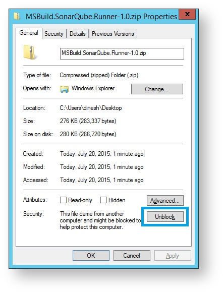
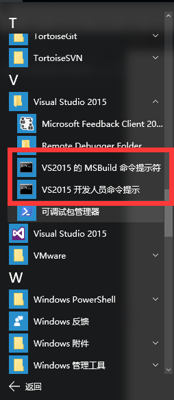
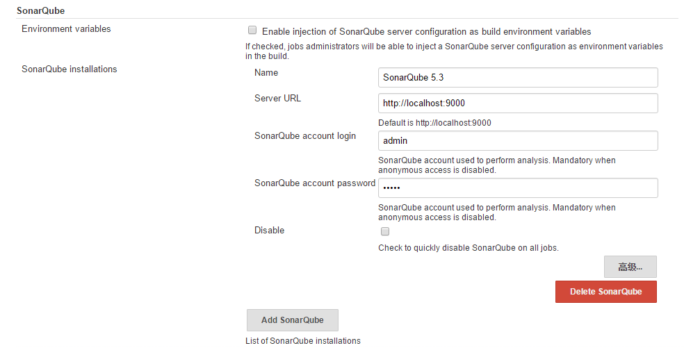
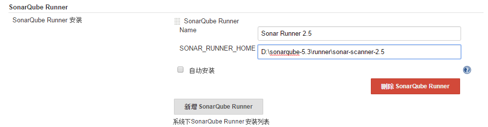
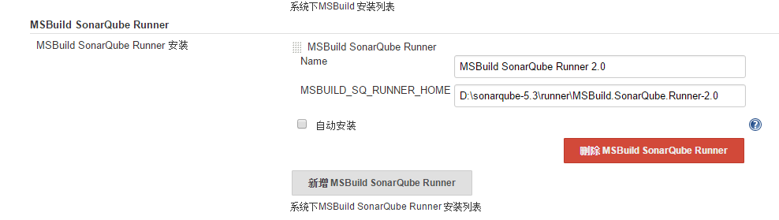
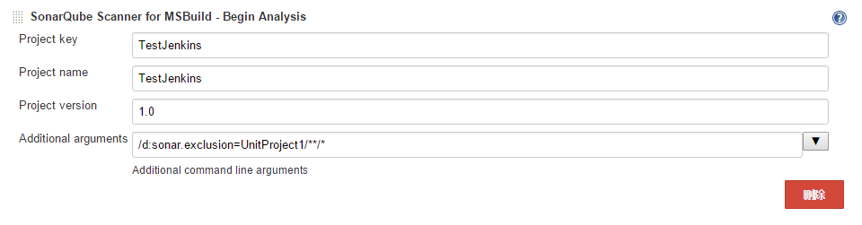

# 分析代码

## 分析范围

 1. 版本管理系统中的文件，支持Git和SVN，其他SCM需要安装插件
 2. 已安装语言插件所支持的文件类型
 3. 其他未识别的文件默认不导入系统分析，可以通过"设置"-->"排除"-->"文件"-->"Import unknown files"设置为true来导入，也可以通过分析参数"sonar.import_unknown_files"来设置

## 分析模式

SonarQube具有三种分析默认，可以通过分析参数"sonar.analysis.mode"来设置

 1. publish - 默认值，分析所有代码并发送结果到服务器，保存结果在数据库中
 2. preview - 预览模式，执行代码分析，但是发送结果到服务器，这种模式可用于在提交到版本库之前的代码检查
 3. issue - 在工具中所使用的“preview”模式，一般不使用

## 分析方式

针对不同的语言和插件，SonarQube提供了不同的分析方式，这里介绍SonarQube Scanner、SonarQube Scanner for MSBuild 和 SonarQube Scanner for Jenkins 三种

> 详情参见[官方文档](http://docs.sonarqube.org/display/SONAR/Analyzing+Source+Code#AnalyzingSourceCode-RunningAnalysis)

### SonarQube Scanner

SonarQube Scanner是SonarQube一个用来分析项目代码的通用分析器，运行在客户机上，用来分析项目代码并发送分析结果到服务器，**要求客户机上有服务器上SonarQube所支持的版本**，而且服务器上应该安装了你所要分析语言的对应插件。

#### 安装SonarQube Scanner

 1. 解压压缩文件到指定目录，如 [安装目录]
 2. 设置环境变量SONAR_RUNNER_HOME指向解压目录，[安装目录]
 3. 添加 [安装目录]/bin 到PATH环境变量中
 4. 设置服务器地址，编辑 **[安装目录]/conf/sonar-runner.properties**:
 ```
 #----- Default SonarQube server
 sonar.host.url=http://localhost:9000
 ```
 5. 检查安装是否成功，linux下执行sonar-runner -h，windows下执行sonar-runner.bat -h，输出如下：
 ```
 usage: sonar-runner [options]
  
 Options:
  -D,--define <arg>     Define property
  -e,--errors           Produce execution error messages
  -h,--help             Display help information
  -v,--version          Display version information
  -X,--debug            Produce execution debug output
 ```

#### SonarQube Scanner用法

在项目文件根目录中创建*sonar-project.properties*文件，文件中以"#"开始的行为注释行，其他皆为"key=value"格式的键值对，用来设定分析代码时使用的分析参数，如下：

```
# 在给定SonarQube服务器中唯一
sonar.projectKey=my:project
# 在SonarQube UI界面中显示的名字
sonar.projectName=My Project
sonar.projectVersion=1.0

# 源代码路径，相对于sonar-project.properties文件的路径
# 默认为"."，表示当前目录
# 如果设置了sonar.modules则可以省略此参数
sonar.sources=.

# 如果服务器设置了sonar.forceAuthentication参数为true
# 可以通过"设置"-->"权限"-->"权限"-->"Force user authentication"设置
# 则只有被授予*Execute Analysis*权限的用户才可以执行分析并发送到服务器
# 故需要在分析时验证用户身份
sonar.login=myLogin
sonar.password=myPassword
```

以上为分析时的基本设置，另外，如果工程中含有多个模块，想为不同的模块制定不同的分析参数，则需要使用sonar.module参数，详情见[官方文档](http://docs.sonarqube.org/display/SONAR/Analyzing+with+SonarQube+Scanner#Multi-module Project)

另外，分析参数不仅可以通过sonar-project.properties文件定义，也可以通过命令行参数传递，如：
```
sonar-runner -Dsonar.projectKey=myproject -Dsonar.sources=src1
```
而且，也可以为分析指定特定的sonar-project.properties文件：
```
sonar-runner -Dproject.settings=../myproject.properties
```

### SonarQube Scanner for MSBuild

MSBuild是微软提供的根据项目或解决方案文件生成指定文件的工具，随Visual Studio安装，也可以独立安装，实际上我们使用Visual Studio所编写的.NET项目都是使用这个工具构建编译的。

SonarQube Scanner for MSBuild是微软和SonarQube合作推出的用于分析MSBuild工程和解决方案的分析器，**.NET项目推荐使用这个方式来进行代码分析**。

当然，运行这个分析器需要指定版本的MSBuild和语言插件（C#，VB.NET等），笔者撰写文档时所使用的SonarQube Scanner for MSBuild 2.0推荐使用MSBuild 14.0+（Visual Studio 2015自带），为了更好的支持Roslyn编译器，不过，MSBuild 12.0（Visual Studio 2013自带）仍然支持使用，虽然官方声明会在将来的版本中移除对其的支持，但现阶段来说仍可使用，另外，也可以自己安装MSBuild 14.0+。

> 详情参见 [官方文档](http://docs.sonarqube.org/display/SONAR/Analyzing+with+SonarQube+Scanner+for+MSBuild#Prerequisites)

#### 安装 SonarQube Scanner for MSBuild

安装SonarQube Scanner for MSBuild除了需要相应版本的MSBuild以外，还需要制定的.NET Framework和Java环境，Java运行时只要安装对应服务器要求的相应版本就可以，而另外两个，可以通过安装对应版本的Visual Studio即可，如撰写本文时所需的MSBuild 12.0+以及.NET 4.5.2+，只要安装Visual Studio 2013即可，当然，安装Visual Studio 2015更佳。这里，笔者以Visual Studio 2015为例继续以下的安装。

 1. 右键解压文件，单击*"属性"*，点击*"UnBlock"*按钮（*没有可以跳过*）
 
 

 2. 解压压缩文件到指定目录，如 [安装目录]
 3. 编辑 [安装目录]/SonarQube.Analysis.xml文件，设置分析参数：
    - sonar.host.url : 服务器地址，如：http://localhost:9000
    - 若服务设置了sonar.forceAuthentication，则需验证身份，添加sonar.login和sonar.password参数
 4. **可选**，添加 [安装目录] 到PATH环境变量中

#### SonarQube Scanner for MSBuild 用法

SonarQube Scanner for MSBuild可以从命令行、Visual Studio Team Services、Team Foundation Server里运行，这里仅介绍从命令行里运行：

 1. 打开"VS2015的MSBuild命令提示符工具"或"VS2015开发人员命令提示"，如下：  
 

> **提示**：在使用的过程中需要使用MSBuild工具构建工程，所以需要当前打开的命令行窗口中MSBuild命令可用，所以以上述两种的方式打开命令行界面，因为在以平常方式打开的命令行界面里MSBuild命令是不可用的。

 2. 切换到项目根目录下，执行以下命令：
    - 开始执行分析
    ```
    MSBuild.SonarQube.Runner.exe begin /k:"sonarqube_project_key" /n:"sonarqube_project_name" /v:"sonarqube_project_version"
    ```
    - 生成项目，如下：
    ```
    msbuild /t:Rebuild
    ```
    - 结束执行分析
    ```
    MSBuild.SonarQube.Runner.exe end
    ```
 3. 稍后就可以在浏览器中看到分析结果了

#### SonarQube Scanner for MSBuild分析参数配置

SonarQube Scanner for MSBuild从三个地方读取分析参数：配置文件参数，命令行参数，工程文件参数。

配置文件参数是指在SonarQube.Analysis.xml文件中配置的参数，其中所配置的皆为全局设置，默认读取 [安装目录]/SonarQube.Analysis.xml文件，也可以通过命令行"/s"参数指定；命令行参数是指在运行分析器时所带的参数，其中"/v","/n","/k"是只能在命令行中指定的参数；同SonarQube Scanner 一样，SonarQube Scanner for MSBuild也可以在命令中通过"/d"添加额外的分析参数，如sonar.host.url；如下：

```
MSBuild.SonarQube.Runner.exe /v:1.0 /n:"My project" /k:my.project /d:sonar.host.url=http://myServer:9001 /s:C:\SharedSettings\SonarQube.Analysis.xml
```

##### 项目分析参数

工程文件参数针对项目设置，在MSBuild工程文件中定义（*.csproj），如下：
```
<SonarQubeSetting Include="sonar.stylecop.projectFilePath">
    <Value>$(MSBuildProjectFullPath)</Value>
</SonarQubeSetting>
```

##### 排除指定项目

有些特定类型的工程会自动重分析中排除，比如：[Microsoft Fakes](https://msdn.microsoft.com/en-us/library/hh549175.aspx)在构建中生成的项目，**这些自动生成的项目不会被分析**，如果想要排除某个项目，可以在项目文件中添加如下属性：
```
<PropertyGroup>
    <SonarQubeExclude>true</SonarQubeExclude>
</PropertyGroup>
```

##### 排除指定文件

项目中由Visual Studio自动生成的文件将不会被分析，如：XX.Designer.cs
```
<Compile Include="Resources.Designer.cs">
    <AutoGen>True</AutoGen>
    <DesignTime>True</DesignTime>
    <DependentUpon>Resources.resx</DependentUpon>
</Compile>
```

也可以手动设置指定文件不被包含的分析列表中：
```
<ItemGroup>
    <Compile Include="MyFile.cs">
        <SonarQubeExclude>true</SonarQubeExclude>
    </Compile>
</ItemGroup>
```

### SonarQube Scanner for Jenkins

我们可以在Jenkins自动构建过程中触发SonarQube的代码分析服务

#### Jenkins服务器配置

 1. 安装Sonar插件：SonarQube Plugin，安装方法参见[Jenkins安装文档](../jenkins/01 installtion.md#_2)
 2. 添加SonarQube服务器，在Jenkins管理员界面，"系统管理"-->"系统设置"，在SonarQube节点下单击"Add SonarQube"
 3. 在添加的"SonarQube Installtions"节点下配置SonarQube服务器，如下：
 

> 注：若是5.2以下的SonarQube则需单击"高级"配置数据库

 4. 在"SonarQube Runner"节点下配置SonarQube Scanner，如下：
 

 5. 在"MSBuild SonarQube Runner"节点下配置SonarQube Scanner for MSBuild，如下：
 

> 注：也可以选择自动安装，SonarQube Scanner可以从Maven Central安装，SonarQube Scanner for MSBuild 可以从GitHub安装

#### 项目配置

针对.NET项目，使用SonarQube Scanner for MSBuild主要是配置"构建"节点，在项目配置页面"构建"节点下，依次添加"SonarQube Scanner for MSBuild - Begin Analysis"，"Build a Visual Studio project or solution using MSBuild"和"SonarQube Scanner for MSBuild - End Analysis"，然后进行相应的配置即可。

在"SonarQube Scanner for MSBuild - Begin Analysis"节点中配置的项和在命令行中需要的参数是一致的，"Project Key"，"Project name"和"Project version"为必填项，另可以添加其他命令行参数，如下：


"Build a Visual Studio project or solution using MSBuild"节点配置详见[Jenkins与.NET](../jenkins/01 installtion.md#_4)