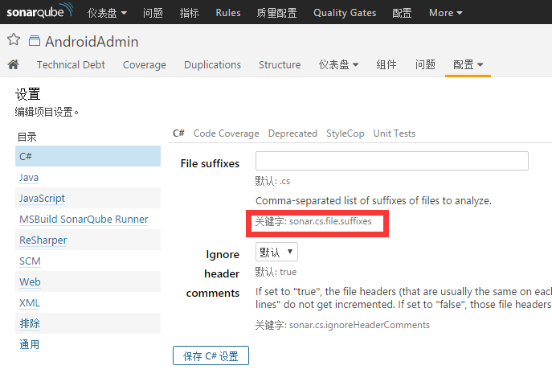

# 分析参数

## 参数继承关系

项目分析参数可以在多个地方设置，继承关系如下：

 - 全局分析参数，通过Web UI设置，作用于所有项目（配置-->通用-->通用中设置）
 - 项目分析参数，通过WebUI设置，覆盖全局参数（在项目级别的配置-->设置中设置）
 - 项目分析参数，定义在项目的分析设置文件(如：sonar-project.properties)和分析器的配置文件(如：sonar-runner.properties)，覆盖WebUI中设置的项目分析参数
 - 命令行参数，在开始分析时通过命令指定的参数(如：-d 或 /d:)，可以覆盖项目分析参数

> 注：只有WebUI中配置的参数会存储在数据库中


下面的参数列表并不完整，在WebUI中全局或项目级别的设置，都可以作为分析参数，如下图中的关键字：



## 必备参数

执行项目分析必须指定的参数

| 关键字 | 描述 | 默认值 |
| ------ |:---- |:------ |
|sonar.host.url|服务器地址|http://localhost:9000|
|sonar.projectKey|项目Key唯一标示,可以是字母、数字、'-'、'_'、'.'和':'，但至少要包含一个字母||
|sonar.projectName|项目名称||
|sonar.projectVersion|项目版本||
|sonar.sources|源代码文件夹，多个用','分开||

## 可选参数

| 关键字 | 描述 | 默认值 |
| ------ |:---- |:------ |
| **身份验证**
|sonar.login|用户名或者是[身份认证令牌](http://docs.sonarqube.org/display/SONAR/User+Token)||
|sonar.password|用户密码，若使用身份认证令牌则可忽略此属性||
| **项目配置**
|sonar.projectDescription|项目描述||
|sonar.tests|测试文件目录，多个用','分开||
|sonar.analysis.mode|[分析模式](02 Analyzing Code.md#_3)(publish/preview/issues)|publish|
|sonar.language|需要分析源码的语言，默认执行多语言分析||
|sonar.sourceEncoding|源码编码格式|系统编码格式|
|sonar.projectBaseDir|项目主目录，用于分析开始时的当前目录不是项目主目录的情况，可以是相对目录也可以是绝对目录||
|sonar.working.directory|用于SonarQube Runner执行分析时的工作目录，可以是相对目录，也可以是绝对目录|.sonar|
| **分析日志**
|sonar.log.level|设置分析过程中的日志级别(INFO/DEBUG/TRACE,其中TRACE级别会输出SQL语句及其执行的事件)|INFO|

### 忽略文件

有以下几种方式来缩小要分析源码的范围，如下：

 1. 源代码目录：设置*sonar.sources*参数指定源代码目录的范围 
 2. 文件后缀：许多语言都提供了限制文件后缀名的的参数，'配置'-->'通用'-->'[语言]'，设置File suffixes属性
 3. **选择指定文件**：
    - *sonar.exclusions/sonar.test.exclusions* 设置分析**除指定文件以外的所有文件**
    - *sonar.inclusions/sonar.test.inclusions* 设置**仅仅分析指定的文件**

#### 通配符

|符号|匹配|
| ---- |:---- |
|*|匹配一个或多个字符|
|**|匹配一个或多个目录|
|?|匹配一个字符|

如下：

```
# 排除所有Bean结尾的类
# 匹配org/sonar.api/MyBean.java, org/sonar/util/MyOtherBean.java, org/sonar/util/MyDTO.java等
sonar.exclusions=**/*Bean.java,**/*DTO.java

# 排除src/main/java/org/sonar目录下所有文件
# 但不包括其子目录下的文件
sonar.exclusions=src/main/java/org/sonar/*

# 排除bank目录及其子目录下的所有文件
sonar.exclusions=bank/**/*

# 排除bank目录及其子目录下的所有.cs文件
sonar.exclusions=bank/**/*.cs
```

> 详情见[官方文档](http://docs.sonarqube.org/display/SONAR/Analysis+Parameters)