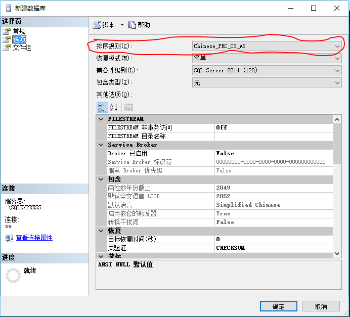
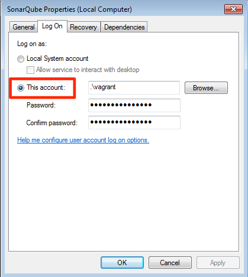
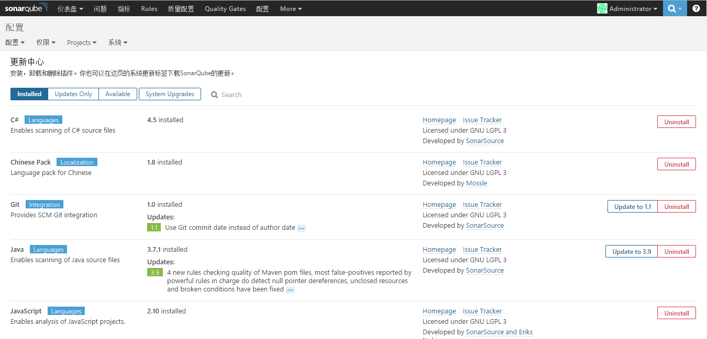

# SonarQube安装

## 要求

1. 至少1G以上内存，推荐为2G
2. Java:Oracle JRE 7u75+,OpenJDK 7u75+
3. 数据库：
    - Microsoft SQL Server 2008/2012/2014
    - MySQL 5.1/5.5
    - Oracle 11g/12c(**[Oracle 11.2.x drivers](http://www.oracle.com/technetwork/database/enterprise-edition/jdbc-112010-090769.html)**))
    - PostgreSQL 8.x/9.x

> **注**:使用Microsoft SQL Server时，数据库的排序规则必须为“大小写敏感”(CS)和“重音敏感”(AS)，如下图中选择的“Chinese_PRC_CS_AS”:
> 

> 详情参考：http://docs.sonarqube.org/display/SONAR/Requirements

## 安装

### 1. 新建数据库方案
以Oracle为例，创建数据库方案

执行以下语句，新建sonarqube表空间和用户，并授予相应的权限

```
CREATE TABLESPACE sonarqube
  DATAFILE '/opt/oracle/oradata/orcl/sonarqube.dbf' SIZE 512M
  AUTOEXTEND ON NEXT 512M MAXSIZE 20480M;

CREATE USER sonarqube IDENTIFIED BY sonarqube;

GRANT CONNECT, RESOURCE ,DBA TO sonarqube;
```

### 2. 安装SonarQube

解压sonarqube.zip压缩包到指定位置

#### 配置数据库连接

打开 **<安装目录>/conf/sonar.properties** 文件配置数据库连接，文件中含有每一种数据库连接的样例，根据需要取消掉指定行前面的注释，配置正确的连接，用户名，密码即可，这里我们使用的是Oracle数据库，取消sonar.jdbc.username、sonar.jdbc.password、sonar.jdbc.url（Oracle）行注释，如下：

```
sonar.jdbc.username=sonarqube
sonar.jdbc.password=sonarqube
sonar.jdbc.url=jdbc:oracle:thin:@192.168.5.13:1521/orcl
```

#### 添加JDBC驱动

SonarQube自带除了Oracle以外的数据库驱动，需要将Oralce JDBC驱动拷贝到 **<安装目录>/extensions/jdbc-driver/oracle** 目录下

> **注**:不支持ojdbc14.jar驱动，12.1.0.1和12.1.0.2的驱动含有bug，不建议使用，另外，仅支持thin模式连接，不支持OCI

#### 启动SonarQube服务器
默认端口为9000，默认路径为：/sonar，可以在**<安装目录>/conf/sonar.properties**文件中配置，如下：

```
sonar.web.host=127.0.0.1
sonar.web.port=9000
sonar.web.context=/sonar
```

执行 **<安装目录>/bin/windows-x86-XX/StartSonar.bat** 脚本来启动服务器，然后就可以通过http://localhost:9000来访问SonarQube服务器(管理员账户用户名密码admin/admin)，首次访问因为需要初始化数据库所以会比较慢。

#### 安装SonarQube服务
**以管理员身份运行** **<安装目录>/bin/windows-x86-XX/InstallNTService.bat** 即可将SonarQube作为服务安装在Windows上

然后修改服务运行时的登录用户，如下：



运行 **<安装目录>/bin/windows-x86-XX/StartNTService.bat** 脚本可以启动SonarQube服务。

## 插件

SonarQube本身并不具备任何的代码检查规则，所有的规则都是以插件的形式安装到SonarQube服务器中的，为此，SonarQube也提供了Web端的界面进行插件管理，可以进行插件的安装、卸载、升级。

登录SonarQube后，在Web界面中单击上方"Administration"-->"System"-->"Update Center"进入更新中心，可以进行插件的管理及系统的升级，如下：



下载、安装、卸载、升级插件都可以在这里完成，SonarQube的插件不仅仅是代码检查规则，还包括语言包等一些辅助功能的插件，点击安装，下载完成后重启服务即可。

在更新中心中管理插件需要联网下载插件，下载完成的插件保存在 **<安装目录>/extensions/downloads**文件夹下，若是没有网络环境，则可将下载完成的插件(*.jar文件)拷贝到  **<安装目录>/extensions/plugins**文件夹下，重启服务即可。
